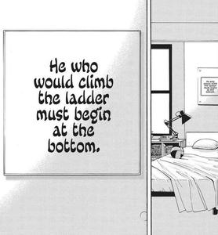

  

<h2 align="center">wassup, I am Ayoub Koudri 👋</h2>

I am an ambitious kid willing to do whatever it takes to work for FANG companies one day,
  and then do something his own 
I love challenging myself, and taste the dopamine dose after solving a problem.

---

## 🚀 Currently Learning

  
  
  

---

## 🧠 Interests

💡 Exploring new ideas • 📊 Algorithms & Problem Solving • 🔍 Understanding how things work

---

## 🎯 My Goal

🎨 Build cool projects with C and Linux 
  • Solve medium-hard LeetCode problems 
  • Reach solid C1 level in English

---

## 📊 GitHub Stats

  
  

  <pre>
        _
      (•~•)  "WHAT IF" IS THE DEVIL'S TRAP, KEEP GRINDING!!
      <| |>
       / \
  </pre>

  
   
  <small>📆 Weekly Activity </small>

---

## 🎓 Education

  
   
  
    
  <small>
    📚 Currently studying at 42 Network / 1337 School Morocco — a wonderful environnement for collaboration, and success 🚀
  </small>

  

---

## 📫 Let's Connect

  
    
  📧 <a href="mailto:likewhatsit@gmail.com">likewhatsit@gmail.com</a>

